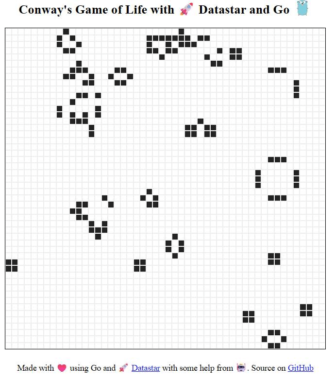

# Conway's Game of Life with Go and Datastar

A realtime, multiplayer implementation of Conway's Game of Life built with Go
and 🚀 [Datastar](https://data-star.dev/).

The board is shared between connected clients, with updates streamed to the
browser over Server-Sent Events (SSE).



## Features

- 50 × 50 Game of Life board (configurable via `-num-cells`, default 2500)
- Realtime updates every 200 ms (configurable via `-refresh-int`, default 200ms)
- Shared game state between connected clients
- Click or drag to add cells
- Server-Sent Events for realtime updates
- Brotli-compressed SSE stream
- No JavaScript framework required (except Datastar itself)
- Go's standard `net/http` server

## Tech Stack

- [Go](https://go.dev/)
- [Datastar](https://data-star.dev/)
- Go `html/template`
- Server-Sent Events (SSE)
- Brotli compression

## Getting Started

### Install and Run

Install the application using `go install`:

```bash
go install github.com/fraenky8/datastar-cgol-go@latest
```

Run the binary

```
datastar-cgol-go
```

Open [http://localhost:8000](http://localhost:8000) in your browser.

Exit the binary via `CTRL+C`

### Available flags:

```bash
$ datastar-cgol-go -help
Usage of datastar-cgol-go:
  -addr host:port
        address for the server to listen on, in the form host:port (default "localhost:8000")
  -num-cells uint
        number of cells, will be rounded down if not sqrt'able (default 2500)
  -refresh-int duration
        refresh interval (default 200ms)
```

## How It Works

The Game of Life simulation runs on the server and advances every 200 ms.

Connected browsers subscribe to the game state through an SSE stream.
When a new generation is calculated, the server renders the board and 
sends the update to all connected clients.

User interactions are sent back to the server as HTTP requests. 
These are queued and applied before the next generation is calculated.

The board uses a finite grid, so cells outside the board are considered dead.

## Inspiration

This project is inspired by Anders Murphy's
[Clojure: Realtime collaborative web apps without ClojureScript.](https://andersmurphy.com/2025/04/07/clojure-realtime-collaborative-web-apps-without-clojurescript.html)

The original project demonstrates a realtime collaborative Game of Life 
implementation using Clojure and Datastar. This repository explores the 
same idea using Go and Go's standard HTTP server.

## Contributing

If you find any issues, feel free to contribute or make suggestions!
Feel free to send me a pull request.

## License

This project is licensed under the [MIT License](LICENSE).
